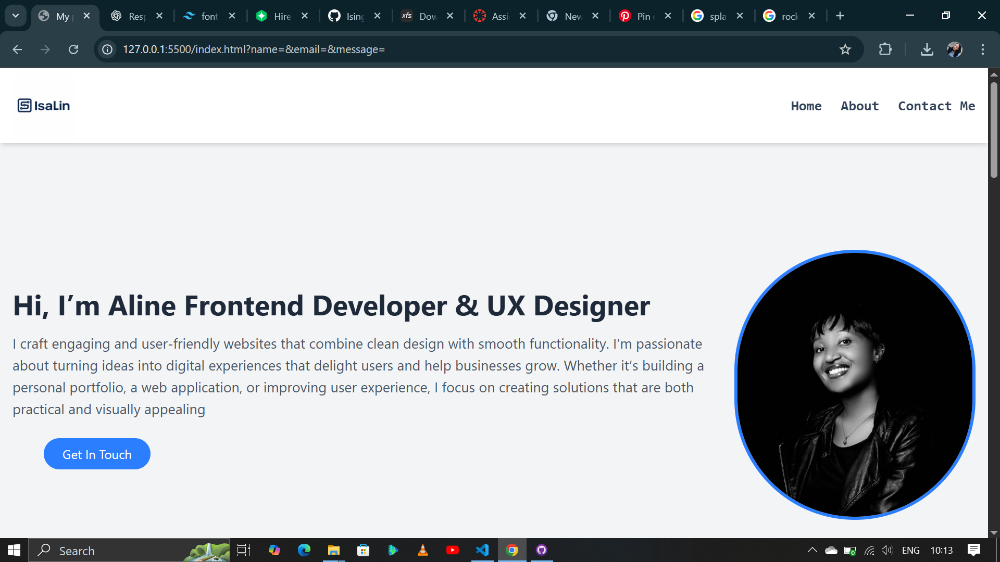

# My Portfolio

Hi! I’m **Isingizwe Aline**, a Frontend Developer and UX Designer.  
This portfolio shows my skills, projects, and ways to contact me.

## Portfolio Screenshot
Here is how my portfolio website looks:

## About Me
I build responsive and user-friendly websites that combine clean design with smooth functionality.  
I enjoy turning ideas into digital experiences that delight users and help businesses grow.
.png)

## Skills
- HTML, CSS, JavaScript  
- React, Next.js, Tailwind  
- UX and UI Design 
.png) 

## Projects
1. Todo List – Add, edit, and delete tasks. Built with React, Tailwind, Node.js.  
2. Rock, Paper, Scissors – Play against the computer. Built with HTML, CSS, JavaScript.  
3. Calculator – Basic calculator operations. Built with HTML, CSS, JavaScript, Tailwind. 
.png) 

## Contact
- Email: isingizwealine12@gmail.com  
.png)
  